# Heavy Sudoker

<p align="center">
  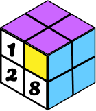
</p>

<p align="center">Heavy Sudoker는 3D 큐브 형태로 클래식 스도쿠 퍼즐을 즐길 수 있는 게임입니다.</p>

<p align="center">
  <a href="https://heavy-sudoker.site">스도쿠 시작하기</a>
</p>

<br>

<p align="center">
  
  
  
  <br>
  
  
  
  
</p>

<br>


# 목차

<!-- toc -->

- [게임 규칙](#%EA%B2%8C%EC%9E%84-%EA%B7%9C%EC%B9%99)
- [기능 소개](#%EA%B8%B0%EB%8A%A5-%EC%86%8C%EA%B0%9C)
- [개발 과정에서의 고민](#%EA%B0%9C%EB%B0%9C-%EA%B3%BC%EC%A0%95%EC%97%90%EC%84%9C%EC%9D%98-%EA%B3%A0%EB%AF%BC)
  * [1. 스도쿠 문제 생성: 백트래킹 적용](#1-%EC%8A%A4%EB%8F%84%EC%BF%A0-%EB%AC%B8%EC%A0%9C-%EC%83%9D%EC%84%B1-%EB%B0%B1%ED%8A%B8%EB%9E%98%ED%82%B9-%EC%A0%81%EC%9A%A9)
    + [3D 스도쿠의 제약 조건과 구조적 특성 파악하기](#3d-%EC%8A%A4%EB%8F%84%EC%BF%A0%EC%9D%98-%EC%A0%9C%EC%95%BD-%EC%A1%B0%EA%B1%B4%EA%B3%BC-%EA%B5%AC%EC%A1%B0%EC%A0%81-%ED%8A%B9%EC%84%B1-%ED%8C%8C%EC%95%85%ED%95%98%EA%B8%B0)
    + [구현 과정: 백트래킹 알고리즘과 문제 해결을 위한 3D 스도쿠 구조 변경](#%EA%B5%AC%ED%98%84-%EA%B3%BC%EC%A0%95-%EB%B0%B1%ED%8A%B8%EB%9E%98%ED%82%B9-%EC%95%8C%EA%B3%A0%EB%A6%AC%EC%A6%98%EA%B3%BC-%EB%AC%B8%EC%A0%9C-%ED%95%B4%EA%B2%B0%EC%9D%84-%EC%9C%84%ED%95%9C-3d-%EC%8A%A4%EB%8F%84%EC%BF%A0-%EA%B5%AC%EC%A1%B0-%EB%B3%80%EA%B2%BD)
    + [개선할 점: 유효성 검사 로직의 최적화와 난이도 조정 방식 추가](#%EA%B0%9C%EC%84%A0%ED%95%A0-%EC%A0%90-%EC%9C%A0%ED%9A%A8%EC%84%B1-%EA%B2%80%EC%82%AC-%EB%A1%9C%EC%A7%81%EC%9D%98-%EC%B5%9C%EC%A0%81%ED%99%94%EC%99%80-%EB%82%9C%EC%9D%B4%EB%8F%84-%EC%A1%B0%EC%A0%95-%EB%B0%A9%EC%8B%9D-%EC%B6%94%EA%B0%80)
  * [2. 스도쿠의 난이도 결정하기](#2-%EC%8A%A4%EB%8F%84%EC%BF%A0%EC%9D%98-%EB%82%9C%EC%9D%B4%EB%8F%84-%EA%B2%B0%EC%A0%95%ED%95%98%EA%B8%B0)
    + [난이도에 따른 빈 칸 개수 설정](#%EB%82%9C%EC%9D%B4%EB%8F%84%EC%97%90-%EB%94%B0%EB%A5%B8-%EB%B9%88-%EC%B9%B8-%EA%B0%9C%EC%88%98-%EC%84%A4%EC%A0%95)
    + [초기 구현 시 발생한 문제: 불균형한 빈 칸 배치](#%EC%B4%88%EA%B8%B0-%EA%B5%AC%ED%98%84-%EC%8B%9C-%EB%B0%9C%EC%83%9D%ED%95%9C-%EB%AC%B8%EC%A0%9C-%EB%B6%88%EA%B7%A0%ED%98%95%ED%95%9C-%EB%B9%88-%EC%B9%B8-%EB%B0%B0%EC%B9%98)
    + [해결 방안: 빈 칸 재분배 과정을 추가하여 균형 맞추기](#%ED%95%B4%EA%B2%B0-%EB%B0%A9%EC%95%88-%EB%B9%88-%EC%B9%B8-%EC%9E%AC%EB%B6%84%EB%B0%B0-%EA%B3%BC%EC%A0%95%EC%9D%84-%EC%B6%94%EA%B0%80%ED%95%98%EC%97%AC-%EA%B7%A0%ED%98%95-%EB%A7%9E%EC%B6%94%EA%B8%B0)
  * [3. 사용자를 위한 3D 보드의 펼쳐지는 애니메이션 구현](#3-%EC%82%AC%EC%9A%A9%EC%9E%90%EB%A5%BC-%EC%9C%84%ED%95%9C-3d-%EB%B3%B4%EB%93%9C%EC%9D%98-%ED%8E%BC%EC%B3%90%EC%A7%80%EB%8A%94-%EC%95%A0%EB%8B%88%EB%A9%94%EC%9D%B4%EC%85%98-%EA%B5%AC%ED%98%84)
    + [문제점: 3D 스도쿠의 시각적 복잡함과 불편한 조작](#%EB%AC%B8%EC%A0%9C%EC%A0%90-3d-%EC%8A%A4%EB%8F%84%EC%BF%A0%EC%9D%98-%EC%8B%9C%EA%B0%81%EC%A0%81-%EB%B3%B5%EC%9E%A1%ED%95%A8%EA%B3%BC-%EB%B6%88%ED%8E%B8%ED%95%9C-%EC%A1%B0%EC%9E%91)
    + [해결 방안: 펼쳐보기 애니메이션 적용하기](#%ED%95%B4%EA%B2%B0-%EB%B0%A9%EC%95%88-%ED%8E%BC%EC%B3%90%EB%B3%B4%EA%B8%B0-%EC%95%A0%EB%8B%88%EB%A9%94%EC%9D%B4%EC%85%98-%EC%A0%81%EC%9A%A9%ED%95%98%EA%B8%B0)
    + [구현 과정: useSpring 훅을 사용하여 애니메이션 구현](#%EA%B5%AC%ED%98%84-%EA%B3%BC%EC%A0%95-usespring-%ED%9B%85%EC%9D%84-%EC%82%AC%EC%9A%A9%ED%95%98%EC%97%AC-%EC%95%A0%EB%8B%88%EB%A9%94%EC%9D%B4%EC%85%98-%EA%B5%AC%ED%98%84)
  * [4. 일반적인 스도쿠를 3D로 구현하기](#4-%EC%9D%BC%EB%B0%98%EC%A0%81%EC%9D%B8-%EC%8A%A4%EB%8F%84%EC%BF%A0%EB%A5%BC-3d%EB%A1%9C-%EA%B5%AC%ED%98%84%ED%95%98%EA%B8%B0)
    + [3D로 구현하기 위한 R3F(React Three Fiber) 선택](#3d%EB%A1%9C-%EA%B5%AC%ED%98%84%ED%95%98%EA%B8%B0-%EC%9C%84%ED%95%9C-r3freact-three-fiber-%EC%84%A0%ED%83%9D)
    + [구현 과정: 스도쿠의 셀을 컴포넌트로 관리](#%EA%B5%AC%ED%98%84-%EA%B3%BC%EC%A0%95-%EC%8A%A4%EB%8F%84%EC%BF%A0%EC%9D%98-%EC%85%80%EC%9D%84-%EC%BB%B4%ED%8F%AC%EB%84%8C%ED%8A%B8%EB%A1%9C-%EA%B4%80%EB%A6%AC)
    + [개선할 점: 3D 스도쿠의 중심축 변경하기](#%EA%B0%9C%EC%84%A0%ED%95%A0-%EC%A0%90-3d-%EC%8A%A4%EB%8F%84%EC%BF%A0%EC%9D%98-%EC%A4%91%EC%8B%AC%EC%B6%95-%EB%B3%80%EA%B2%BD%ED%95%98%EA%B8%B0)
  * [5. 생동감을 위한 사운드 추가](#5-%EC%83%9D%EB%8F%99%EA%B0%90%EC%9D%84-%EC%9C%84%ED%95%9C-%EC%82%AC%EC%9A%B4%EB%93%9C-%EC%B6%94%EA%B0%80)
    + [효과음](#%ED%9A%A8%EA%B3%BC%EC%9D%8C)
    + [배경 음악](#%EB%B0%B0%EA%B2%BD-%EC%9D%8C%EC%95%85)
- [회고](#%ED%9A%8C%EA%B3%A0)

<!-- tocstop -->

<br>

# 게임 규칙

처음 주어진 퍼즐(9x9, 총 81칸의 정사각형)엔 숫자가 일부 채워져 있고 나머지 빈 칸을 다음 규칙에 맞게 넣어야 합니다.

<p align="center">
  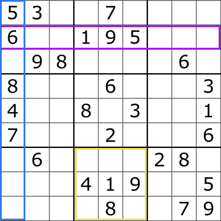
</p>

* 각각의 가로 줄과 세로 줄에 1부터 9까지의 숫자가 중복되지 않도록 한 번만 넣어야 합니다.

* 3x3 블록에 1부터 9까지의 숫자가 중복되지 않도록 한 번만 넣어야 합니다.

* 같은 줄이나 블록에서 하나 이상의 숫자가 같다면 틀린 풀이가 됩니다.

<p align="center">
  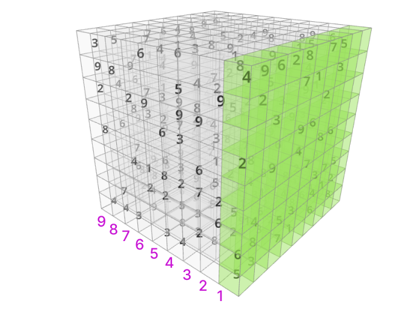
</p>

* 3D 큐브의 각 면마다 스도쿠 문제가 있으며 전체 9개의 스도쿠를 모두 완성하면 게임이 종료됩니다.

<br>


# 기능 소개

<table border="1">
  <tr>
    <td><strong>메인 페이지</strong></td>
  </tr>
  <tr>
    <td>
      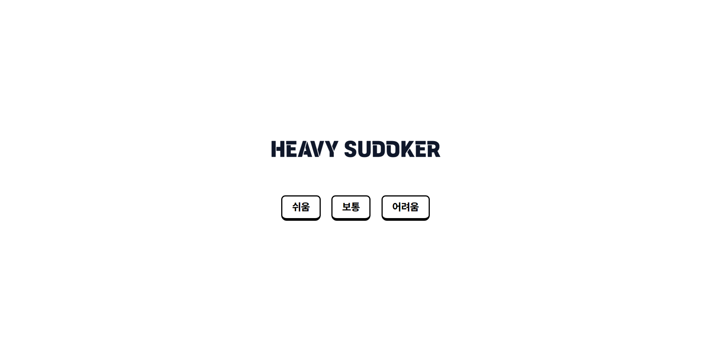
    </td>
  </tr>
  <tr>
    <td>
      - 스도쿠의 <strong>난이도를 선택</strong>할 수 있습니다.<br>
      - 어려운 난이도일수록 주어진 숫자의 개수가 적어집니다.
    </td>
  </tr>
</table>

<br>

<table border="1">
  <tr>
    <td><strong>스도쿠 페이지 (3D)</strong></td>
  </tr>
  <tr>
    <td>
      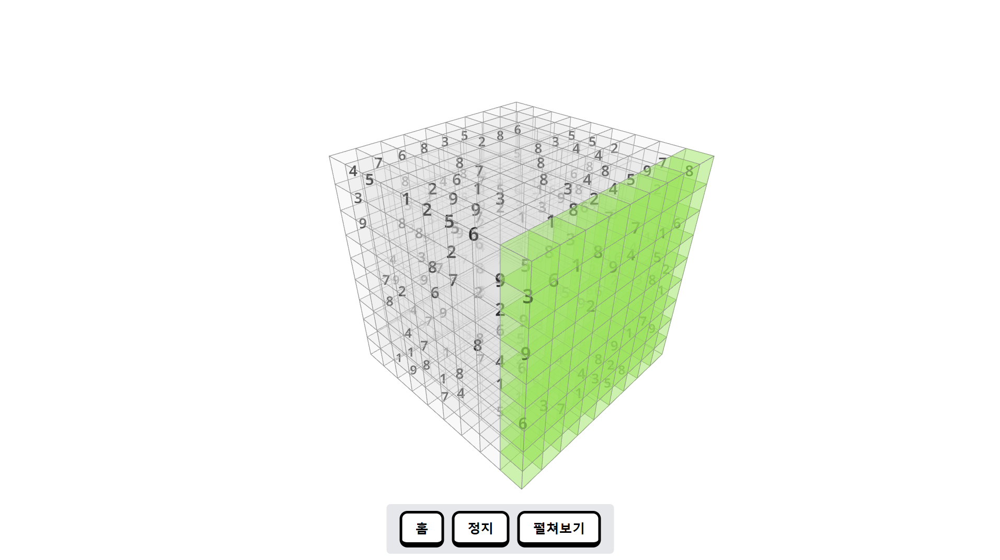
    </td>
  </tr>
  <tr>
    <td>
      - 메인 페이지에서 난이도 선택 후 처음 보여지는 화면입니다.
      <details open>
        <summary>
          <strong>펼쳐보기</strong>: 각각 분리된 9개의 스도쿠 보드를 파악할 수 있습니다.
        </summary>
        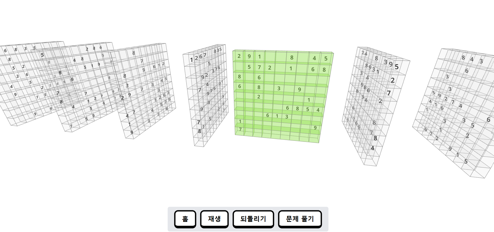
      </details>
      - <strong>문제 풀기</strong>: 펼쳐보기 후에 나타나는 버튼으로, 하이라이트 되어있는<br> 부분의 스도쿠를 풀 수 있는 2D 보드로 전환됩니다.<br>
      - 3D 스도쿠 보드에서는 마우스 좌클릭으로 보드 회전, 마우스 휠을<br> 통해 확대/축소를 할 수 있습니다.
    </td>
  </tr>
</table>

<br>

<table border="1">
  <tr>
    <td><strong>스도쿠 페이지 (2D)</strong></td>
  </tr>
  <tr>
    <td>
      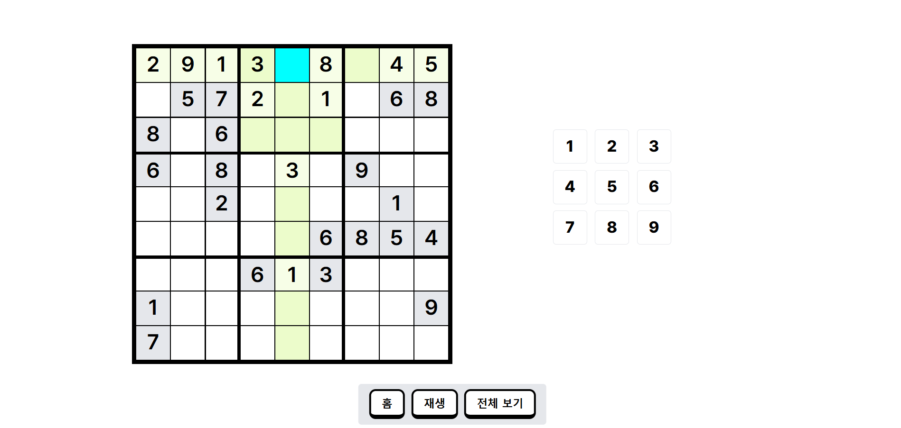
    </td>
  </tr>
  <tr>
    <td>
      - 좌측의 숫자로 스도쿠의 빈 칸을 채울 수 있습니다.<br>
      - <strong>전체 보기</strong>: 3D ↔ 2D 보드 간의 전환이 가능합니다.
    </td>
  </tr>
</table>


<br>

# 개발 과정에서의 고민

## 1. 스도쿠 문제 생성: 백트래킹 적용

### 3D 스도쿠의 제약 조건과 구조적 특성 파악하기
3D 스도쿠 문제 생성 기능을 구현하기 전 가장 먼저 고려한 것은 문제의 크기와 복잡성입니다. 3D 스도쿠는 기존 스도쿠에서 한 단계 확장된 형태로 3차원 배열을 사용해 문제를 만들어야 된다고 예상했습니다. 기본적으로 3D 스도쿠는 크기 9x9x9 의 큐브 형태로 이루어져 있으며 각 층을 하나의 스도쿠처럼 처리하고 제약 조건을 만족해야 하는 점이 큰 도전이었습니다.

3D 스도쿠의 각 셀에 값을 채우기 위해서는 기존 스도쿠의 제약인 각 행, 열, 3x3영역에서 중복되는 숫자가 없어야 하는 것뿐만 아니라 3차원인 깊이에 대한 제약도 필요했습니다.

### 구현 과정: 백트래킹 알고리즘과 문제 해결을 위한 3D 스도쿠 구조 변경
> [!NOTE]
> **백트래킹 (Backtracking)**
>
> 백트래킹은 가능한 답이 될 수 있는 모든 경우를 탐색하며 조건을 만족하지 않는 경로가 확인된 경우 이전 단계로 되돌아가 효율적으로 문제를 해결하는 알고리즘입니다.

문제가 만들어질 때 각 셀에 숫자를 채워가면서 모든 제약 조건을 만족할 수 있는지 확인하는 과정이 필요했습니다.

* 모든 경우의 수를 탐색 가능
* 여러 가지 제약 조건이 있을 때 유효하지 않은 선택을 가지치기

모든 경우를 탐색하며 각 단계마다 선택할 수 있는 숫자를 좁혀나가야 했기 때문에 잘못된 경로를 미리 차단하고 되돌아가며 탐색을 이어가는 방식인 백트래킹 알고리즘이 적합하다고 판단했습니다.

#### 문제점: 3D 스도쿠 제약 조건 처리의 복잡성과 백트래킹 알고리즘의 성능 저하
3D 스도쿠 문제를 생성하는 과정에서 백트래킹 알고리즘을 사용하여 각 셀을 채워가는 방식으로 접근했습니다. 그러나 3차원 조건을 고려했을 때, 모든 제약을 만족시키는 과정에서 성능 저하가 발생하는 문제가 있었습니다.

특히 스도쿠 한 줄이 완성되는 시간이 매우 오래 걸렸으며 전체 문제 생성을 기다리면 페이지가 응답하지 않는 문제가 있었습니다. 이는 백트래킹이 3D 스도쿠의 규칙을 확인하는 과정에서 복잡한 계산을 처리하게 되어 발생한 문제였습니다.

3D 스도쿠는 각 행, 열, 3x3 영역을 고려하는 것에 더해, 깊이 방향의 제약 조건까지 만족시켜야 해서 각 셀을 채울 때마다 모든 제약 조건을 체크하는 비용이 커졌습니다. 3차원 배열에서 한 셀의 값이 확정되기까지 수많은 계산을 반복하게 되어 전체 알고리즘의 실행 시간이 지연되었습니다.

#### 해결 방안: 스도쿠 구조 변경
3D 스도쿠의 구조 자체를 변경하는 방안을 도입했습니다. 기존의 9x9x9 큐브 형태의 3D 스도쿠에서 9개의 독립적인 2D 스도쿠 퍼즐을 큐브 모양으로 배치하는 방식으로 변경하게 되었습니다.

#### 스도쿠 규칙을 고려하여 구현하기
> [!NOTE]
> **스도쿠 규칙**
>
> 1 ~ 9까지의 숫자는 모든 가로줄, 세로줄, 3x3영역에 한 번만 배치되어야 합니다.

스도쿠의 빈 셀을 채우기 위해 한 번에 한 칸씩 나아가며 1 ~ 9까지 가능한 숫자를 시도해 모든 경우를 탐색하는 작업으로 **규칙**에 맞지 않는 숫자가 주어졌을 때는 직전에 숫자를 넣었던 셀로 되돌아가 다른 숫자를 시도하도록 했습니다.

스도쿠 문제가 생성되는 흐름은 다음과 같습니다.

1. **숫자 배열 생성**: 입력 가능한 숫자인 1 ~ 9가 속해있는 배열을 생성합니다.
2. **무작위 숫자 선택**: 생성된 배열에서 하나의 숫자를 무작위로 선택하고 해당 셀에 넣습니다.
3. **스도쿠 규칙 확인**: 숫자가 규칙에 어긋나는지 확인합니다.
   - 규칙에 어긋난다면 1번의 배열에서 해당 숫자를 삭제합니다.
   - 모든 숫자를 적용해본 후 전부 해당되지 않으면 이전 단계로 되돌아가 다시 시도합니다.
   - 규칙에 적합하면 해당 셀에 숫자를 넣은 후 다음 칸으로 이동합니다.

위 과정을 반복하여 81개의 셀을 모두 채워나가게 됩니다. 아래 예시를 보면 물음표가 있는 셀은 같은 가로줄을 봤을 땐 `9`밖에 해당되지 않지만 세로줄과 3x3영역에서 이미 `9`가 사용되었습니다. 이 경우 다시 이전 셀인 17번째 셀로 돌아가 다른 숫자를 시도하게 됩니다.

<p align="center">
  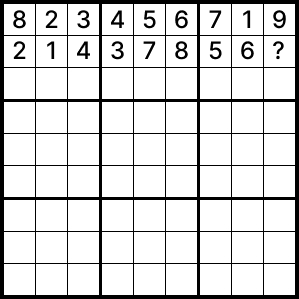
</p>

다시 이전 단계로 되돌아갈 땐 해당 단계에서 실패한 숫자를 기억하고 다시 시도되지 않도록 제거했습니다.


#### 시간 복잡도와 공간 복잡도
* 시간 복잡도: O(n^2)
* 공간 복잡도: O(n^2)

### 개선할 점: 유효성 검사 로직의 최적화와 난이도 조정 방식 추가
1. 제약 조건을 체크하는 함수 최적화

    행, 열, 블록(3x3 영역)에 대해 매번 유효한지 일일이 체크하고 있습니다. 이를 최적화하기 위해 각 셀에 대한 숫자 사용 상태를 저장하는 캐시 배열을 활용할 수 있을 것 같습니다. 새로운 숫자를 추가하게 된다면 이를 업데이트하고 값을 검사할 때 이 배열을 사용해 유효성 검사를 빠르게 할 수 있습니다.

2. 유효하지 않은 선택을 가지치기하는 방식 최적화

    현재는 가능한 모든 숫자를 시도하는 방식으로 문제를 생성하고 있지만 각 셀에 대해 적합한 숫자를 먼저 계산 후 선택하는 방식으로 최적화가 가능할 것 같습니다.

3. 난이도 조정 방식 추가

    난이도 조정을 지금은 빈 칸의 개수로 구현되고 있지만 스도쿠의 후보 숫자의 수를 분석해서 빈 칸을 정할 수 있을 것 같습니다. 각 칸에 가능한 숫자가 많을수록 어려운 단계이므로, 초기 배치를 바탕으로 난이도를 계산하는 방식을 추가해 난이도 조정을 할 수 있습니다.

<br>

## 2. 스도쿠의 난이도 결정하기

### 난이도에 따른 빈 칸 개수 설정
쉬움, 보통, 어려움 3단계로 난이도를 구분했고 쉬울수록 빈 칸의 개수를 적게하여 미리 채워져있는 숫자를 늘렸습니다.

스도쿠는 선택된 셀이 포함되는 같은 가로줄, 세로줄, 3x3 블록에서 각각 1부터 9까지의 숫자가 한 번만 들어가야합니다. 채워진 숫자가 적을수록 유추해야되는 경우의 수가 많아지게 되기 때문에 초반에 주어진 숫자의 개수에 따라 난이도가 달라질 수 있습니다.

처음에는 빈 칸을 무작위로 배치하는 방식으로 구현했습니다. 난이도에 따라 빈 칸의 개수가 정해지면 빈 칸의 위치를 무작위로 선정했고 이 과정을 난이도에 따라 설정된 개수만큼 반복했습니다.

### 초기 구현 시 발생한 문제: 불균형한 빈 칸 배치
빈 칸이 특정 가로줄에 몰리거나 어떤 줄에 9칸이 완전히 채워지는 문제가 있었습니다. 빈 칸이 한쪽으로 치우치거나 가로줄이 완전한 빈 줄일 경우에는 퍼즐의 난이도가 의도된 난이도와 다르게 지나치게 쉽거나 어려워질 수 있었습니다.

<p align="center">
  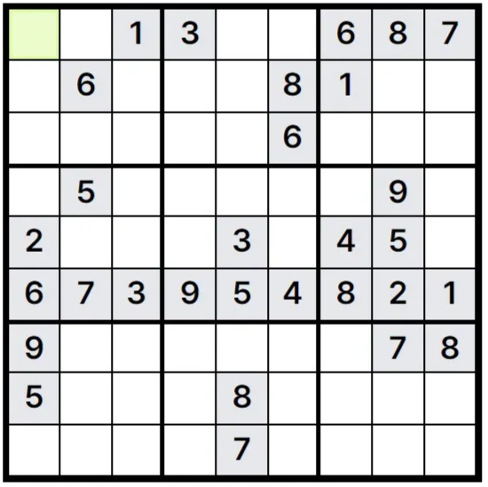
</p>

 ### 해결 방안: 빈 칸 재분배 과정을 추가하여 균형 맞추기
각 가로줄을 확인하여 비어있는 칸을 기록하고 해당 줄에서 추가로 비워야 할 칸이 무엇인지 무작위로 정해지는 단계를 거친 후에 빈 칸 재분배 로직을 추가했습니다.
모든 줄을 체크하여 완전히 비어있는 줄이라면 상대적으로 숫자가 많이 채워진 줄에서 일부를 가져와 추가했습니다. 모든 가로줄에서 최소한 1개의 빈 칸이 존재할 수 있도록 했습니다.

1. 난이도에 따라 스도쿠에서 빈 칸의 수를 결정한다.
2. 빈 칸을 무작위로 배치한다.
3. 빈 칸 배치가 끝난 후 가로줄을 확인하여 비워진 칸이 하나도 없는 인덱스와 빈 칸이 전체 퍼즐 크기의 절반 이상인 가로줄의 인덱스를 기록한다.
4. 비어있는 줄에 빈 칸을 재배치한다.
   - 비어있는 줄이 있을 경우 채워진 줄에서 빈 칸의 인덱스를 가져와 빈 줄에 추가한다.
5. 최종 빈 칸 위치를 반환한다.

https://github.com/supul-i/heavy-sudoker/blob/189d443f9fae3300a7cd4983fed9915de147b59b/src/utils/getEmptyCellsIndex.js#L15-L65

<br>

## 3. 사용자를 위한 3D 보드의 펼쳐지는 애니메이션 구현

<p align="center">
  
  <br>
  펼쳐보기 애니메이션 동작
</p>

### 문제점: 3D 스도쿠의 시각적 복잡함과 불편한 조작
3D 스도쿠는 9x9x9 큐브 형태로 되어있어 일반적인 2D 스도쿠보다 시각적으로 복잡하고 사용자가 현재 풀고있는 영역을 쉽게 파악하기 어려운 문제가 있었습니다.

숫자가 들어있는 모든 큐브가 한꺼번에 표시되고 있어 시각적으로 숫자들이 잘 보이지 않고 또한 특정 층을 강조하지 못해 사용자가 현재 풀이 중인 영역을 인지하기 어려웠습니다.<br>
3D 스도쿠는 일반적인 스도쿠가 아니어서 대부분의 사용자에게 조작이 불편하게 느껴질 가능성이 컸습니다.

### 해결 방안: 펼쳐보기 애니메이션 적용하기
위 문제를 해결하기 위해 3D 스도쿠를 펼쳐볼 수 있는 기능을 추가하고 선택된 영역에 강조효과를 추가하여 사용자가 현재 풀고 있는 영역을 쉽게 인지할 수 있도록 했습니다.

#### 애니메이션 기법 선정: React Spring 선택
애니메이션을 구현하기 전에 어떤 기술이 프로젝트와 적합할지 비교해 봤습니다.

| 기술 | 특징 | 장점 | 단점 |
| --- | --- | --- | --- |
| **React Three Fiber (R3F) - useFrame** | R3F에서 제공하는 훅으로 <br>매 프레임마다 콜백을 호출하기 때문에 3D 씬에서 발생하는 애니메이션을 프레임 단위로 제어 가능 | - 프레임 단위로 애니메이션을 제어하여 부드러운 애니메이션 구현 가능<br><br>- 언마운트 시 자동 콜백 정리로 메모리 누수 방지 | - 빠른 실행으로 로그 기록이<br> 어려움<br><br>- 디버깅이 까다로움 |
| **React Spring - useSpring** | 상태 변화에 따라 자동으로 애니메이션이 동작 | - 물리 기반 애니메이션 제공으로 자연스러운 동작 구현 가능<br><br>- 상태 변화에 따라 자동으로 애니메이션 실행되어 동기화 용이 | 매 프레임마다 동적으로 값을 변경하는 애니메이션에 적합하지 않음 |
| **Tween.js** | 시작과 끝 값을 지정하면 다양한 easing 함수를 사용하여 애니메이션 구현 가능 | - 복잡한 상태 관리 없이 간단히 애니메이션 추가 가능<br><br>- 다양한 환경(DOM, Canvas, WebGL 등)에서 사용 가능<br><br> - 정교한 시간 조정과 상태 간의 연결을 할 때 유용 | React와 직접 통합되지 않아 상태 기반 애니메이션 구현 시 추가 작업 필요하며 기능이 다른 기술에 비해 제한적임 |

물리 기반 애니메이션이므로 추가적인 조정 없이도 부드럽고 자연스러우며 React의 상태를 잘 활용할 수 있는 `React Spring`을 선택하게 되었습니다.

React Spring의 애니메이션을 R3F의 3D 환경에 합하여 사용할 수 있습니다.
* [useSpring](https://www.react-spring.dev/docs/components/use-spring)은 React Spring에서 제공하는 훅으로 물리적 속성을 기반으로 애니메이션을 적용할 수 있다.
*  `animated` 컴포넌트를 사용하여 3D 객체(mesh, group 등)의 속성에 애니메이션 값을 넣을 수 있다. (속성 예시: position, scale, color 등)
*  React 상태와 결합하여 사용자의 클릭이나 마우스 움직임 등에 따라 3D 객체를 애니메이션할 수 있다.

<br>

간단한 예시 코드: React 상태를 이용하여 클릭 시 색상 변경
```js
import { useSpring, animated } from "@react-spring/three";

const [active, setActive] = useState(false);
const { color } = useSpring({
  color: active ? '#000000' : '#FFFFFF',  // React 상태를 이용해서 color 값 설정
});

return (
  // 클릭 이벤트로 상태 변경
  <animated.mesh onClick={() => setActive(!active)} >
    <boxGeometry args={[1, 1, 1]} />
    <animated.meshStandardMaterial color={color} />
  </animated.mesh>
);
```

<br>

### 구현 과정: useSpring 훅을 사용하여 애니메이션 구현
1. 펼쳐지기 버튼의 상태(`isLayerView`)와 이동 애니메이션을 적용할 3D 객체(group)을 props로 받아왔습니다.

2. 3D 스도쿠 큐브의 각 그룹의 위치조정과 회전을 위해 React Spring의 `useSpring` 훅을 활용했습니다. 사용자가 선택한 층은 화면 중앙에 위치하고 나머지 층은 좌우로 이동하며 부드럽게 전환됩니다.

3. 각 판은 여러 3D 객체를 하나의 그룹으로 묶어 변환을 함께 적용할 수 있도록 할 수 있는 `group` 객체로 구성되며 이를 기반으로 위치를 변경했으며 `isLayerView` 상태에 따라 `position` 값이 달라지도록 구현했습니다.

    ```js
    import { animated, useSpring } from "@react-spring/three";

    const X_AXIS_CHANGE = 7;
    const { position, rotation } = useSpring({
      position:
        isLayerView && group.xPosition === currentLayer
          ? [group.xPosition + X_AXIS_CHANGE / 2, 0, 0] // 선택된 층이 중심이 된다.
          : isLayerView
            ? [(group.xPosition - currentLayer) * X_AXIS_CHANGE, 0, 0] // 나머지 층을 좌우로 이동
            : [0, 0, 0],
      rotation: isLayerView && group.xPosition === currentLayer ? -90 * (Math.PI / 180) : 0, // 선택된 층을 회전
    });

    return (
      <animated.group position={position} rotation-y={rotation}>
        {group.cubes}
      </animated.group>
    );
    ```

  4. 나머지 층이 좌우로 이동하면 선택된 층은 카메라 방향으로 90도 회전하도록 했습니다.
      ```js
      -90 * (Math.PI / 180)
      ```

  * Math 객체의 radian 이해
    - 자바스크립트에서 쓰이는 각도는 호도법 (단위: radian)
    - 반지름이 1인 원의 둘레는 2π이므로 1도는 π/180 라디안입니다.
    - 라디안에서 회전 방향: 음수일 때 시계방향을 의미합니다.

#### 구현 결과
3D 스도쿠의 큐브를 각 판별로 분리하고 선택된 판을 화면 중앙에 고정시켰습니다. 나머지 판들은 좌우로 펼쳐져 사용자가 현재 풀고 있는 영역을 직관적으로 파악할 수 있도록 했습니다.<br>
또한 다른 판으로 이동할 때 자연스러운 전환이 이루어지도록 애니메이션을 적용했습니다.

시각적으로 복잡한 퍼즐 구조를 스도쿠 판 별로 분리하면서 가독성을 향상시켜 사용자가 좀 더 쉽게 이해하고 이용할 수 있도록 개선되었습니다.

<br>

## 4. 일반적인 스도쿠를 3D로 구현하기
### 3D로 구현하기 위한 R3F(React Three Fiber) 선택
R3F는 React 환경에서 Three.js를 쉽고 편리하게 사용할 수 있도록 해주는 라이브러리입니다. Three.js를 React 컴포넌트 형태로 사용할 수 있어 3D 구현에 있어서 간편하게 쓸 수 있으며 React의 상태 관리와 훅 시스템을 활용할 수 있습니다.

3D 객체를 React 컴포넌트처럼 관리하여 재사용하기 위해 R3F를 선택하게 되었습니다.

### 구현 과정: 스도쿠의 셀을 컴포넌트로 관리
스도쿠 보드를 구성하는 기본 단위인 셀을 하나의 컴포넌트로 구현했습니다(`cubeCell`). 각 셀은 들어가 있는 숫자, 위치 등 퍼즐 데이터를 가지고 있습니다. 스도쿠 큐브 구조를 가지기 위해 셀 컴포넌트의 key 속성에 위치값을 넣어 리액트가 각 셀을 고유하게 식별하도록 했습니다.

다음으로는 `cubeCell` 컴포넌트를 x축을 기준으로 그룹화하여 `CubeBoard` 컴포넌트에서 렌더링하게 됩니다.
```js
const xValues = Array.from({ length: PUZZLE_SIZE }, (_, i) => i);
const xAxisCubeGroups = xValues.map((xPosition) => ({
  xPosition,
  cubes: cubeMap.filter((cube) => cube.props.position[0] === xPosition),
}));
```
### 셀 상태를 Zustand를 활용하여 전역으로 관리하기
사용자의 입력과 현재 클릭한 셀 등 여러 개의 상태가 필요했습니다. 문제를 풀기에 용이하도록 2D 보드와 같이 구현할 계획이었기 때문에 3D 스도쿠와 2D 스도쿠 간의 상태 공유가 필요했습니다. 복잡한 설정 없이 간단한 API를 제공하여 상태를 공유할 수 있는 Zustand를 도입하여 전역 상태로 관리하게 되었습니다.

스도쿠 셀을 클릭하거나 값을 입력할 때마다 상태가 업데이트됩니다.

```js
const initialState = {
  answerSudoku: [],
  emptyCellPosition: Array.from({ length: 9 }, () => []),
  currentCell: { row: 0, col: 0 },
  currentLayer: 8,
  completedBoards: Array.from({ length: 9 }, () => false),
};

const usePuzzleStore = create(
    (set) => ({
      ...initialState,

      setAnswerSudoku: (newPuzzle) =>
        set(() => ({ answerSudoku: newPuzzle })),

      setEmptyCellPosition: (emptyCellPosition) =>
        set(() => ({ emptyCellPosition: emptyCellPosition })),

      ...
    }),
    { name: "puzzle-storage" }
);
```

### 문제점: 스도쿠 셀 구현의 어려움과 전체 3D 스도쿠 보드의 가독성 문제
예상했던 3D 스도쿠의 형태는 정육면체의 내부가 투명하게 보이면서 숫자는 정중앙에 위치할 수 있도록 하는 것이었습니다.

초반에는 R3F에서 3D 큐브를 생성하는 Box 컴포넌트와 3D 텍스트를 생성하는 Text 컴포넌트를 활용하여 구현했습니다. Box 컴포넌트 안에 Text 컴포넌트를 넣은 후 내부를 투명하게 하기 위해 `wireframe` 속성을 사용했습니다. 이 속성은 3D 객체를 구성하는 모든 모서리가 표시되게 됩니다. 따라서 원하지 않은 대각선의 선까지 나타나게 되었습니다.

또한 Box 안에 Text를 넣었을 때 텍스트가 제대로 렌더링되지 않는 문제가 있었습니다.

해결 방안으로 정육면체를 Line 컴포넌트를 통해 구현한 후 Line과 Text 컴포넌트를 합하여 정육면체 내부에 숫자가 보이고 윤곽선만 나타나도록 했습니다. 그리고 Text 컴포넌트와 Line 컴포넌트를 `Group` 으로 묶어 별도로 관리했습니다.

> [!NOTE]
> **Group**
>
> 여러 3D 객체를 하나로 묶어 관리할 수 있게 해주는 컨테이너 역할을 하는 객체로 Group에 포함된 모든 객체에 한 번에 위치, 회전 등을 변경할 수 있다.

### 해결 방안: 3D 스도쿠 보드에서 사용자가 선택한 면에 하이라이트 기능 구현
초기에는 모든 숫자가 똑같은 선명도로 보이고 여러 개의 스도쿠가 모여있는 형태라 현재 선택된 판을 알기 힘든 모습이었습니다.

<table width="100%">
  <tr align="center">
    <td>
      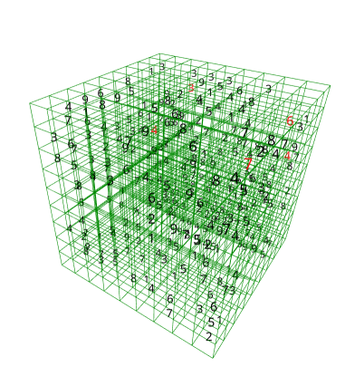
    </td>
    <td>
      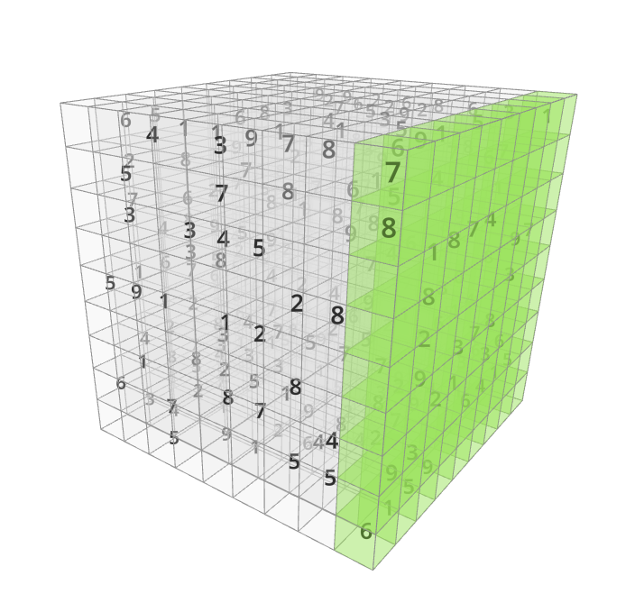
    </td>
  </tr>
  <tr align="center">
    <td>초기 모습</td>
    <td>현재 모습</td>
  </tr>
</table>

#### 3D 스도쿠 보드의 가독성을 높이기 위한 시도
* 안개 효과

    fog 컴포넌트를 사용하여 배경을 흐릿하게 처리하여 사용자와 가까운 곳의 숫자의 값은 선명하게 보이도록 했으나 스도쿠 특성 상 한 면에 있는 숫자들이 선명해져야 했기 때문에 사용성 개선은 되지 않았습니다.

* 선택된 스도쿠를 투명화하기

    사용자가 선택한 스도쿠가 투명해지도록 처리했지만 투명한 면 양쪽으로 색이 채워져있어 오히려 가독성이 떨어졌습니다.

#### 선택되지 않은 셀에는 Box 컴포넌트를 추가하고 선택된 셀에 하이라이트 하기

  색을 지정하지 않은 Box 컴포넌트를 사용자가 선택한 스도쿠 면이 아닌 모든 셀에 적용하여 숫자의 선명도를 줄였습니다.

  현재 선택된 셀의 위치를 전역 상태로 두어 해당 상태와 각 셀의 위치값을 비교하여 같은 부분만 color 속성을 추가한 Box 컴포넌트를 추가했습니다. 이로 인해 스도쿠 보드가 하이라이트되면서 퍼즐마다 명확히 구분지을 수 있게 되었습니다.

  ```js
    {isHighlighted ? (
      <Box args={[1, 1, 1]} position={[0.5, 0.5, -0.5]}>
        <meshBasicMaterial transparent={true} opacity={0.5} color={"#39FF14"} />
      </Box>
    ) : (
      <Box args={[1, 1, 1]} position={[0.5, 0.5, -0.5]}>
        <meshBasicMaterial transparent={true} opacity={0.2} />
      </Box>
    )}
  ```
  `isHighlighted` 상태에 따라 다른 color가 적용된 Box 컴포넌트가 렌더링됩니다.

### 개선할 점: 3D 스도쿠의 중심축 변경하기
현재 마우스를 사용하여 화면을 움직일 때 중심축이 스도쿠 보드의 중앙이 아니라 왼쪽 아래 꼭지점 위치(0,0,0)에 있어서 화면을 움직일 때 어색한 느낌이 있습니다. 현재는 보드의 인덱스와 실제 좌표의 값이 동일하지만 두 값을 분리한 후에 위치를 중앙축으로 변경할 수 있을 것 같습니다.


## 5. 생동감을 위한 사운드 추가

게임에서의 효과음은 게임을 생동감있게 만들어 사용자의 몰입감을 높여주는 중요한 요소라고 생각되어 스도쿠 문제 풀이가 시작되거나 클릭이벤트가 발생할 때 브라우저에서 오디오를 재생하기 위해 사용되는 Audio 객체를 활용하여 효과음과 배경음악을 추가했습니다.

### 효과음
   * 2D 스도쿠에서 셀 선택: 클릭 사운드
   * 숫자 패드 or 숫자 키보드 선택: 키패드 사운드

각 효과음을 Audio 객체로 생성 후 상황에 맞게 재생할 수 있도록 유틸리티 함수를 작성했습니다. 효과음이 쓰이는 컴포넌트의 외부에서 사운드 기능을 관리하여 역할이 명확히 분리되도록 했습니다.

### 배경 음악
   * 메인 페이지에서 난이도를 선택하고 스도쿠가 보여지면서 재생되는 음악을 넣었으며 사용자가 배경음을 제어할 수 있도록 재생/정지 기능을 구현했습니다.

배경 음악을 재생하고 관련 속성을 제어하는 컴포넌트를 정의했습니다. useRef와 useState를 활용하여 재생/정지 기능과 볼륨 제어를 구현했습니다.
Audio 객체의 `loop`, `volume`속성을 사용했으며 이 속성을 컴포넌트 props로 받아 배경 음악의 반복재생여부와 볼륨을 설정할 수 있도록 했습니다.

<br>

# 회고

이 프로젝트를 통해 3D 스도쿠 큐브의 구조를 설계하고 데이터를 효율적으로 다루는 방법에 대해 많은 고민을 했습니다. 3D를 다루게 되어 새로운 걸 익힐 수 있는 기회였고 사용자가 이 프로젝트를 쉽게 이용할 수 있도록 개선하는 과정에서 사용자의 모든 움직임에 대한 반응이나 직관적으로 표현되도록 하는 것이 중요하다는 것을 알게 되었습니다.

프로젝트를 진행하면서 일정 관리에 어려움이 있었습니다. 초반에는 태스크 우선순위를 명확히 정하지 못하고 세부 구현에만 몰두한 탓에 일정이 지연되었지만 짧은 일정 상 핵심 기능부터 먼저 구현하고 작업을 작은 단위로 나누는 방식으로 진행하면서 태스크 관리가 좀 더 수월해졌던 것 같습니다.

앞으로도 다양한 사용자들의 피드백을 적극 반영하여 더욱 직관적이고 완성도 높은 3D 스도쿠를 만들어가고 싶습니다.
