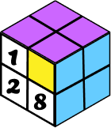
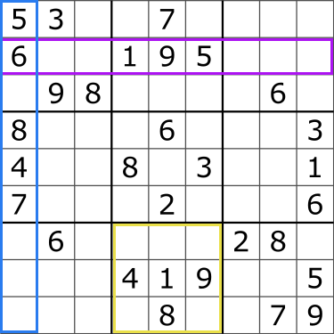
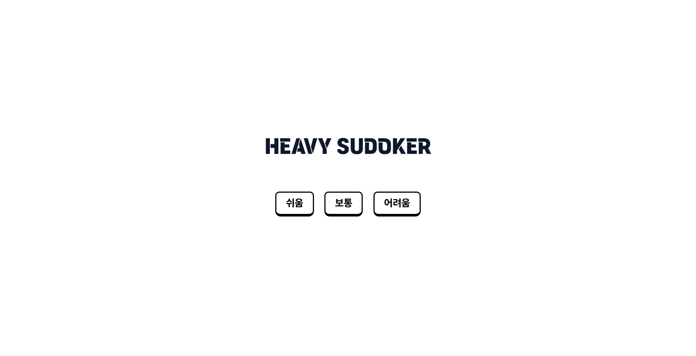
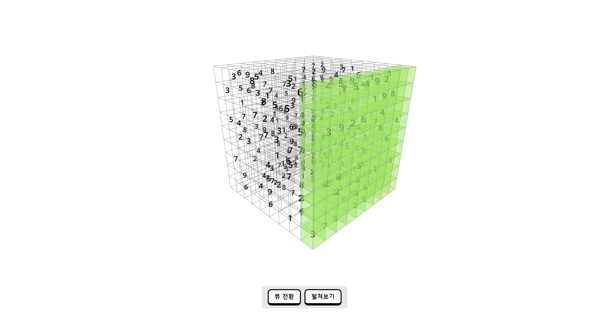
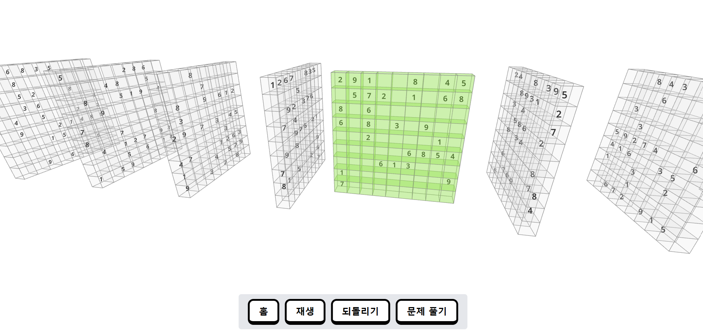
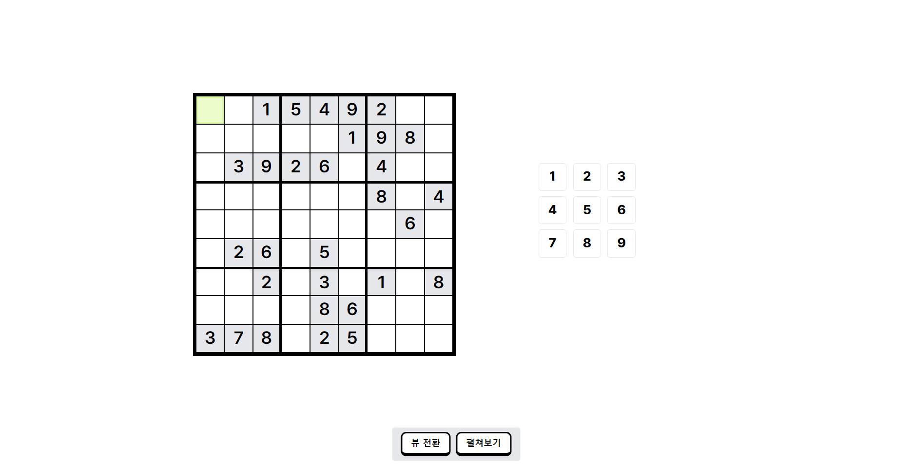
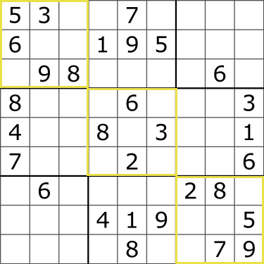

# Heavy Sudoker

<p align="center">
  
</p>

<p align="center">Heavy Sudoker는 3D 큐브 형태로 클래식 스도쿠 퍼즐을 즐길 수 있는 게임입니다.</p>

<p align="center">
  <a href="https://heavy-sudoker.netlify.app/">Deployed website</a>
  <span> | </span>
  <a href="https://github.com/supul-i/heavy-sudoker">Frontend Repository</a>
</p>

<br>

<p align="center">
  
  
  
  <br>
  
  
  
  
</p>

<br>


# 목차

- [게임 규칙](#%EA%B2%8C%EC%9E%84-%EA%B7%9C%EC%B9%99)
- [기능](#%EA%B8%B0%EB%8A%A5)
- [개발 과정에서의 고민](#%EA%B0%9C%EB%B0%9C-%EA%B3%BC%EC%A0%95%EC%97%90%EC%84%9C%EC%9D%98-%EA%B3%A0%EB%AF%BC)
  * [스도쿠 문제 생성: 알고리즘 최적화 과정](#%EC%8A%A4%EB%8F%84%EC%BF%A0-%EB%AC%B8%EC%A0%9C-%EC%83%9D%EC%84%B1-%EC%95%8C%EA%B3%A0%EB%A6%AC%EC%A6%98-%EC%B5%9C%EC%A0%81%ED%99%94-%EA%B3%BC%EC%A0%95)
    + [3D 스도쿠의 구조](#3d-%EC%8A%A4%EB%8F%84%EC%BF%A0%EC%9D%98-%EA%B5%AC%EC%A1%B0)
    + [문제 생성 구현](#%EB%AC%B8%EC%A0%9C-%EC%83%9D%EC%84%B1-%EA%B5%AC%ED%98%84)
  * [단순하게 생성되는 스도쿠 로직 개선하기](#%EB%8B%A8%EC%88%9C%ED%95%98%EA%B2%8C-%EC%83%9D%EC%84%B1%EB%90%98%EB%8A%94-%EC%8A%A4%EB%8F%84%EC%BF%A0-%EB%A1%9C%EC%A7%81-%EA%B0%9C%EC%84%A0%ED%95%98%EA%B8%B0)
  * [퍼즐의 난이도 결정하기](#%ED%8D%BC%EC%A6%90%EC%9D%98-%EB%82%9C%EC%9D%B4%EB%8F%84-%EA%B2%B0%EC%A0%95%ED%95%98%EA%B8%B0)
    + [초기 구현의 문제점: 불균형한 빈 칸 배치](#%EC%B4%88%EA%B8%B0-%EA%B5%AC%ED%98%84%EC%9D%98-%EB%AC%B8%EC%A0%9C%EC%A0%90-%EB%B6%88%EA%B7%A0%ED%98%95%ED%95%9C-%EB%B9%88-%EC%B9%B8-%EB%B0%B0%EC%B9%98)
    + [빈 칸 재분배 과정 추가](#%EB%B9%88-%EC%B9%B8-%EC%9E%AC%EB%B6%84%EB%B0%B0-%EA%B3%BC%EC%A0%95-%EC%B6%94%EA%B0%80)
  * [3D 스도쿠에서의 사용성 개선 방안](#3d-%EC%8A%A4%EB%8F%84%EC%BF%A0%EC%97%90%EC%84%9C%EC%9D%98-%EC%82%AC%EC%9A%A9%EC%84%B1-%EA%B0%9C%EC%84%A0-%EB%B0%A9%EC%95%88)

<br>

# 게임 규칙

일반적인 스도쿠 규칙과 거의 동일합니다. 처음 주어진 퍼즐(9x9, 총 81칸의 정사각형)엔 숫자가 일부 채워져 있고 나머지 빈 칸을 다음 규칙에 맞게 넣어야 합니다. 3D 큐브의 각 면마다 스도쿠 문제가 있으며 전체 9개의 스도쿠를 모두 완성하면 게임이 종료됩니다.

<p align="center">
  
</p>

* 1부터 9까지의 숫자가 중복되지 않도록 한 번만 넣어 각각의 가로 줄과 세로 줄을 채워야 합니다.

* 1부터 9까지의 숫자가 중복되지 않도록 한 번만 넣어 3x3 블록을 채워야 합니다.

* 같은 줄이나 블록에서 하나 이상의 숫자가 같다면 틀린 풀이가 됩니다.

<br>


# 기능

* 총 9개의 스도쿠 풀이에 성공한다면 게임이 종료됩니다.
* 3D 스도쿠 보드에서는 마우스 좌클릭으로 보드 회전, 마우스 휠을 통해 확대/축소를 할 수 있습니다.

<br>

<table border="1">
  <tr>
    <td><strong>메인 페이지</strong></td>
  </tr>
  <tr>
    <td>
      
    </td>
  </tr>
  <tr>
    <td>
      - 스도쿠의 <strong>난이도를 선택</strong>할 수 있습니다.<br>
      - 어려운 난이도일수록 주어진 숫자의 개수가 적어집니다.
    </td>
  </tr>
</table>

<br>

<table border="1">
  <tr>
    <td><strong>스도쿠 페이지 (3D)</strong></td>
  </tr>
  <tr>
    <td>
      
    </td>
  </tr>
  <tr>
    <td>
      - 메인 페이지에서 난이도 선택 후 처음 보여지는 화면입니다.
      <details>
        <summary>
          <strong>펼쳐보기</strong>: 각각 분리된 9개의 스도쿠 보드를 파악할 수 있습니다.
        </summary>
        
      </details>
      - <strong>문제 풀기</strong>: 펼쳐보기 후에 나타나는 버튼으로, 하이라이트 되어있는 부분의 스도쿠를 풀 수 있는 2D 보드로 전환됩니다.
    </td>
  </tr>
</table>

<br>

<table border="1">
  <tr>
    <td><strong>스도쿠 페이지 (2D)</strong></td>
  </tr>
  <tr>
    <td>
      
    </td>
  </tr>
  <tr>
    <td>
      - 좌측의 숫자로 스도쿠의 빈 칸을 채울 수 있습니다.<br>
      - <strong>전체 보기</strong>: 3D ↔ 2D 보드 간의 전환이 가능합니다.
    </td>
  </tr>
</table>


<br>

# 개발 과정에서의 고민

## 스도쿠 문제 생성: 알고리즘 최적화 과정

### 3D 스도쿠의 구조
기존 2D 스도쿠를 확장한 형태로 각 2D 평면(9x9)은 하나의 스도쿠 문제이며 가로, 세로, 3x3 블록 내에서 중복이 없어야 합니다.
3D 큐브형식이므로 9개의 스도쿠가 각각 독립적으로 위 규칙을 충족해야합니다. 배열을 생성하여 총 9개의 스도쿠의 문제를 저장했습니다.

### 문제 생성 구현
스도쿠 문제를 생성하는 과정에서 백트래킹 알고리즘을 최적화하여 코드가 간결해지고 문제 생성의 속도가 개선되었습니다.

> [!NOTE]
> **백트래킹 (Backtracking)**
> 백트래킹은 가능한 답이 될 수 있는 모든 경우를 탐색하며 조건을 만족하지 않는 경로가 확인된 경우 이전 단계로 되돌아가 효율적으로 문제를 해결하는 알고리즘입니다.

규칙에 맞지 않는 숫자를 제거하여 불필요한 탐색 시도를 줄였습니다. 기존 접근 방식은 중복적인 로직이 있었습니다. 백트래킹 방식으로 빈 셀에 값을 채워넣는 과정에서 이전 단계에서 실패한 숫자를 기억하고 다시 시도되지 않도록 제거하는 작업이 중복적으로 일어나고 있었습니다.

1. `previousNum`변수를 사용하여 이전에 시도했던 숫자를 기억하여 시도 가능한 숫자가 저장된 배열 `validNumber`에서 제외시키는 로직
2. 배열 `validNumber`에서 셀에서 유효하지 않은 숫자인 경우에만 제거하는 로직

2번 로직은 다음 셀에 숫자를 채우는 경우 1~9까지 모든 숫자를 실패하여 다시 백트랙킹 후 이전 셀의 숫자가 제거되었을 때는 적용되지 않았습니다. 적용되는 경우는 백트래킹이 일어나지 않고 유효한 숫자가 아니라고 판단되는 경우였습니다.
1번과 2번 로직을 따로 구분해놓을 필요없이 유효하지 않은 숫자는 후보 배열에서 제거되도록 불필요한 변수인 `previousNum`을 지웠습니다.

```js
  let validNumbers = Array.from({ length: 9 }, (_, i) => i + 1);

  while (validNumbers.length > 0) {
    const randomIndex = Math.floor(Math.random() * validNumbers.length);
    const number = validNumbers[randomIndex];

    if (isValid(sudoku, rowIndex, colIndex, number)) {
      sudoku[rowIndex][colIndex] = number;

      if (fillRemainCells(sudoku, rowIndex, colIndex + 1)) {
        return true;
      }

      sudoku[rowIndex][colIndex] = 0; // 백트래킹
    }

    validNumbers.splice(randomIndex, 1); // 유효하지 않은 숫자는 후보 배열에서 제거
  }
```

<br>

## 단순하게 생성되는 스도쿠 로직 개선하기

스도쿠 문제 생성 후 가로 방향으로 이동하며 채워진 숫자를 살펴봤을 때 2,3,4,5 또는 6,7,8,9 처럼 순차적으로 숫자가 채워져있는 경우가 나타났습니다. 난이도가 쉬울수록 사용자가 풀이해야 하는 빈 칸이 적기 때문에 단조로운 답으로 스도쿠가 생성된다면 너무 쉽게 게임이 끝날 가능성이 있었습니다.

기존 9x9 정사각형 크기의 스도쿠 문제는 아래와 같은 과정을 거쳐 생성되었습니다.
<p align="center">
  
</p>

1. 대각선 3x3 블록부터 1부터 9까지의 숫자가 중복되지 않도록 채운다.
2. 첫 번째 줄부터 가로 방향으로 이동하며 나머지 빈 셀을 채운다.
3. 셀이 채워질 때마다 해당 셀이 포함되는 가로 줄, 세로 줄, 3x3 블록 각각 같은 숫자가 있는지 확인한다.
4. 모든 셀이 채워지면 스도쿠 문제를 담은 배열을 반환한다.

처음엔 보드의 셀이 모두 빈 칸이므로 스도쿠 규칙을 확인하는 제약 조건없이 채울 수 있는 곳은 대각선 방향의 블록이었습니다. 따라서 특별한 확인 절차없이 1 ~ 9의 숫자가 한 번만 들어가는 조건만을 고려하여 우선적으로 채워주었습니다. 그 뒤로는 순차적으로 위 과정과 같이 2번 ~ 4번 절차를 진행했습니다.

순차적인 숫자 배치의 원인은 2번 과정에서 일어났습니다. 빈 셀을 채울 때 1부터 9까지 순차적으로 넣으며 해당 셀에 적합한지 확인하는 절차를 가졌습니다. 예를 들어 1행4열의 빈 셀에 들어갈 수 있는 후보가 `[1,2,3,5,8,9]` 라고 한다면 해당 셀을 채울 때 배열의 첫 번째 인덱스부터 차례대로 넣으며 확인했습니다. 따라서 해당 셀에는 1이 채워지고 후보 배열에서 1이 삭제된 후 다음 셀에는 순차적으로 첫 번째 인덱스가 된 2가 채워졌습니다.

```js
// 빈 셀에서 확인할 후보 숫자 배열
let validNumbers = Array.from({ length: 9 }, (_, i) => i + 1);

  while(validNumbers.length > 0) {
   // validNumbers에서 무작위로 숫자 추출
    const randomIndex = getRandomNum(validNumbers.length);
    const randomNumber = validNumbers[randomIndex];

    if (isValid(sudoku, rowIndex, colIndex, randomNumber)) {

      sudoku[rowIndex][colIndex] = randomNumber;

      if (fillRemainCells(sudoku, rowIndex, colIndex + 1)) {
        return true;
      }

      sudoku[rowIndex][colIndex] = 0;
    }

    validNumbers.splice(randomIndex, 1);
  }
```
이를 해결하기 위해서 빈 셀에 채워질 수 있는 후보 숫자들을 넣는 방식을 변경해야 했습니다. 후보 숫자가 담긴 배열의 인덱스를 무작위로 선택하게 하여 빈 셀에 넣도록 로직을 변경했고 그 결과 배열 안의 요소도 무작위로 선정되어 단조로운 정답 패턴을 해결할 수 있었습니다.

<br>

## 퍼즐의 난이도 결정하기

스도쿠는 선택된 셀이 포함되는 같은 가로줄, 세로줄, 3x3 블록에서 각각 1부터 9까지의 숫자가 한 번만 들어가야합니다. 채워진 숫자가 적을수록 유추해야되는 경우의 수가 많아지게 되기 때문에 초반에 주어진 숫자의 개수에 따라 난이도가 변경됩니다.

이 프로젝트에서는 쉬움, 보통, 어려움 3단계로 난이도를 구분했고 쉬울수록 빈 칸의 개수를 적게하여 미리 채워져있는 숫자를 늘렸습니다.

처음에는 빈 칸을 무작위로 배치하는 방식으로 구현했습니다. 난이도에 따라 빈 칸의 개수가 정해지면 빈 칸의 위치를 무작위로 선정했고 이 과정을 난이도에 따른 개수만큼 반복했습니다.

### 초기 구현의 문제점: 불균형한 빈 칸 배치
빈 칸의 배치 과정에서 특정 가로줄이 완전히 비거나 9칸이 모두 채워져있는 문제가 있었습니다. 빈 칸이 한쪽으로 치우치거나 가로줄이 완전한 빈 줄일 경우에는 퍼즐의 난이도가 의도된 난이도와 다르게 지나치게 쉽거나 어려워질 수 있었습니다.

 ### 빈 칸 재분배 과정 추가
각 줄에서 이미 비워진 칸을 기록하고 해당 줄에서 추가로 비워야 할 칸이 무엇인지 무작위로 정해지는 과정 후에 균형 재배치 로직을 추가했습니다. 모든 줄을 검사하여 완전히 비어있는 줄이라면 상대적으로 숫자가 많이 채워진 줄에서 일부를 가져와 최소 1줄 당 1개의 빈 칸을 가질 수 있도록 했습니다.

1. 난이도에 따라 스도쿠에서 빈 칸의 수를 결정한다.
2. 빈 칸을 무작위로 배치한다.
3. 빈 칸 배치가 끝난 후 가로줄을 확인하여 비워진 칸이 하나도 없는 인덱스와 빈 칸이 전체 퍼즐 크기의 절반 이상인 가로줄의 인덱스를 기록한다.
4. 빈 줄에 빈 칸을 재배치한다.
   - 빈 줄이 있을 경우 꽉 찬 줄에서 빈 칸의 인덱스를 가져와 빈 줄에 추가한다.
5. 최종 빈 칸 위치를 반환한다.

https://github.com/supul-i/heavy-sudoker/blob/189d443f9fae3300a7cd4983fed9915de147b59b/src/utils/getEmptyCellsIndex.js#L42C1-L54C44


<br>

## 3D 스도쿠에서의 사용성 개선 방안

3D 스도쿠에서는 일반적인 2D 스도쿠와는 달리 9x9x9 큐브 형태로 구성되어 숫자가 들어있는 모든 큐브가 한꺼번에 표시되고 있어 시각적으로 숫자들이 잘 보이지 않고 또한 특정 층을 강조하지 못해 사용자가 현재 풀고있는 영역을 쉽게 인지할 수 없었습니다.<br>
3D 스도쿠는 일반적인 스도쿠가 아니어서 대부분의 사용자에게 조작이 불편하게 느껴질 가능성이 컸습니다.

위 문제를 해결하기 위해 3D 스도쿠를 펼쳐볼 수 있는 기능을 추가했습니다.
스도쿠 큐브의 특정 판을 분리해 이동시키고 나머지 판들은 좌우로 펼쳐 사용자가 이용 중인 영역을 쉽게 파악할 수 있도록 했습니다.<br>
사용자가 현재 풀이하고 있는 판을 화면 중앙에 고정하도록 하여 직관성을 높였으며 다른 판으로 이동할 때 자연스러운 전환이 되도록 애니메이션을 적용했습니다.

```js
const X_AXIS_CHANGE = 7;
const { position, rotation } = useSpring({
  position:
    isLayerView && group.xPosition === currentLayer
      ? [group.xPosition + X_AXIS_CHANGE / 2, 0, 0] // 선택된 층을 중앙으로 이동
      : isLayerView
        ? [(group.xPosition - currentLayer) * X_AXIS_CHANGE, 0, 0] // 나머지 층을 좌우로 이동
        : [0, 0, 0], // 기본 위치
  rotation: isLayerView && group.xPosition === currentLayer ? -90 * (Math.PI / 180) : 0, // 선택된 층을 회전
});

return (
  <animated.group position={position} rotation-y={rotation}>
    {group.cubes}
  </animated.group>
);
```
* 각 판은 `group` 객체로 구성되며 이를 기반으로 위치를 변경했습니다.
* 3D 스도쿠 큐브의 각 그룹의 위치조정과 회전을 위해 React Spring의 `useSpring` 훅을 활용했습니다.

시각적으로 복잡한 퍼즐 구조를 스도쿠 판 별로 분리하면서 가독성을 향상시켜 좀 더 쉽게 이해하고 이용할 수 있도록 개선되었습니다.


## 회고
