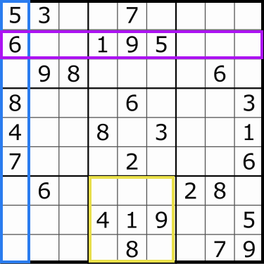
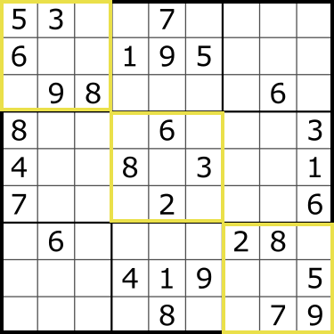
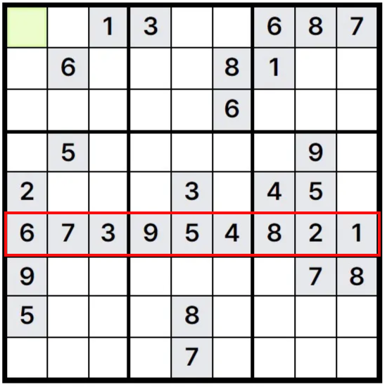

# Heavy Sudoker

<p align="center">
  
</p>

<p align="center">Heavy Sudoker는 3D 큐브 형태로 클래식 스도쿠 퍼즐을 즐길 수 있는 게임입니다.</p>

<p align="center">
  <a href="https://heavy-sudoker.site">스도쿠 게임 시작</a>
</p>

<br>

<p align="center">
  
  
  
  <br>
  
  
  
  
</p>

<br>


# 목차

<!-- toc -->

- [게임 규칙](#%EA%B2%8C%EC%9E%84-%EA%B7%9C%EC%B9%99)
- [기능](#%EA%B8%B0%EB%8A%A5)
- [개발 과정에서의 고민](#%EA%B0%9C%EB%B0%9C-%EA%B3%BC%EC%A0%95%EC%97%90%EC%84%9C%EC%9D%98-%EA%B3%A0%EB%AF%BC)
  * [1. 스도쿠 문제 생성: 백트래킹 적용](#1-%EC%8A%A4%EB%8F%84%EC%BF%A0-%EB%AC%B8%EC%A0%9C-%EC%83%9D%EC%84%B1-%EB%B0%B1%ED%8A%B8%EB%9E%98%ED%82%B9-%EC%A0%81%EC%9A%A9)
    + [3D 스도쿠의 구조](#3d-%EC%8A%A4%EB%8F%84%EC%BF%A0%EC%9D%98-%EA%B5%AC%EC%A1%B0)
    + [문제 생성 구현](#%EB%AC%B8%EC%A0%9C-%EC%83%9D%EC%84%B1-%EA%B5%AC%ED%98%84)
  * [2. 단순하게 생성되는 스도쿠 숫자 배치 개선하기](#2-%EB%8B%A8%EC%88%9C%ED%95%98%EA%B2%8C-%EC%83%9D%EC%84%B1%EB%90%98%EB%8A%94-%EC%8A%A4%EB%8F%84%EC%BF%A0-%EC%88%AB%EC%9E%90-%EB%B0%B0%EC%B9%98-%EA%B0%9C%EC%84%A0%ED%95%98%EA%B8%B0)
  * [3. 스도쿠의 난이도 결정하기](#3-%EC%8A%A4%EB%8F%84%EC%BF%A0%EC%9D%98-%EB%82%9C%EC%9D%B4%EB%8F%84-%EA%B2%B0%EC%A0%95%ED%95%98%EA%B8%B0)
    + [난이도에 따른 빈 칸 개수 설정](#%EB%82%9C%EC%9D%B4%EB%8F%84%EC%97%90-%EB%94%B0%EB%A5%B8-%EB%B9%88-%EC%B9%B8-%EA%B0%9C%EC%88%98-%EC%84%A4%EC%A0%95)
    + [초기 구현 시 발생한 문제: 불균형한 빈 칸 배치](#%EC%B4%88%EA%B8%B0-%EA%B5%AC%ED%98%84-%EC%8B%9C-%EB%B0%9C%EC%83%9D%ED%95%9C-%EB%AC%B8%EC%A0%9C-%EB%B6%88%EA%B7%A0%ED%98%95%ED%95%9C-%EB%B9%88-%EC%B9%B8-%EB%B0%B0%EC%B9%98)
    + [빈 칸 재분배 과정을 추가하여 균형 맞추기](#%EB%B9%88-%EC%B9%B8-%EC%9E%AC%EB%B6%84%EB%B0%B0-%EA%B3%BC%EC%A0%95%EC%9D%84-%EC%B6%94%EA%B0%80%ED%95%98%EC%97%AC-%EA%B7%A0%ED%98%95-%EB%A7%9E%EC%B6%94%EA%B8%B0)
  * [4. 3D 스도쿠의 사용성 개선](#4-3d-%EC%8A%A4%EB%8F%84%EC%BF%A0%EC%9D%98-%EC%82%AC%EC%9A%A9%EC%84%B1-%EA%B0%9C%EC%84%A0)
    + [시각적 복잡함과 불편한 조작](#%EC%8B%9C%EA%B0%81%EC%A0%81-%EB%B3%B5%EC%9E%A1%ED%95%A8%EA%B3%BC-%EB%B6%88%ED%8E%B8%ED%95%9C-%EC%A1%B0%EC%9E%91)
    + [펼쳐보기 애니메이션 구현](#%ED%8E%BC%EC%B3%90%EB%B3%B4%EA%B8%B0-%EC%95%A0%EB%8B%88%EB%A9%94%EC%9D%B4%EC%85%98-%EA%B5%AC%ED%98%84)
  * [5. 사용자 경험을 높이는 사운드 추가](#5-%EC%82%AC%EC%9A%A9%EC%9E%90-%EA%B2%BD%ED%97%98%EC%9D%84-%EB%86%92%EC%9D%B4%EB%8A%94-%EC%82%AC%EC%9A%B4%EB%93%9C-%EC%B6%94%EA%B0%80)
    + [효과음](#%ED%9A%A8%EA%B3%BC%EC%9D%8C)
    + [배경 음악](#%EB%B0%B0%EA%B2%BD-%EC%9D%8C%EC%95%85)
- [회고](#%ED%9A%8C%EA%B3%A0)

<!-- tocstop -->

<br>

# 게임 규칙

처음 주어진 퍼즐(9x9, 총 81칸의 정사각형)엔 숫자가 일부 채워져 있고 나머지 빈 칸을 다음 규칙에 맞게 넣어야 합니다.

<p align="center">
  
</p>

* 각각의 가로 줄과 세로 줄에 1부터 9까지의 숫자가 중복되지 않도록 한 번만 넣어야 합니다.

* 3x3 블록에 1부터 9까지의 숫자가 중복되지 않도록 한 번만 넣어야 합니다.

* 같은 줄이나 블록에서 하나 이상의 숫자가 같다면 틀린 풀이가 됩니다.

<p align="center">
  
</p>

* 3D 큐브의 각 면마다 스도쿠 문제가 있으며 전체 9개의 스도쿠를 모두 완성하면 게임이 종료됩니다.

<br>


# 기능

<table border="1">
  <tr>
    <td><strong>메인 페이지</strong></td>
  </tr>
  <tr>
    <td>
      
    </td>
  </tr>
  <tr>
    <td>
      - 스도쿠의 <strong>난이도를 선택</strong>할 수 있습니다.<br>
      - 어려운 난이도일수록 주어진 숫자의 개수가 적어집니다.
    </td>
  </tr>
</table>

<br>

<table border="1">
  <tr>
    <td><strong>스도쿠 페이지 (3D)</strong></td>
  </tr>
  <tr>
    <td>
      
    </td>
  </tr>
  <tr>
    <td>
      - 메인 페이지에서 난이도 선택 후 처음 보여지는 화면입니다.
      <details open>
        <summary>
          <strong>펼쳐보기</strong>: 각각 분리된 9개의 스도쿠 보드를 파악할 수 있습니다.
        </summary>
        
      </details>
      - <strong>문제 풀기</strong>: 펼쳐보기 후에 나타나는 버튼으로, 하이라이트 되어있는<br> 부분의 스도쿠를 풀 수 있는 2D 보드로 전환됩니다.<br>
      - 3D 스도쿠 보드에서는 마우스 좌클릭으로 보드 회전, 마우스 휠을<br> 통해 확대/축소를 할 수 있습니다.
    </td>
  </tr>
</table>

<br>

<table border="1">
  <tr>
    <td><strong>스도쿠 페이지 (2D)</strong></td>
  </tr>
  <tr>
    <td>
      
    </td>
  </tr>
  <tr>
    <td>
      - 좌측의 숫자로 스도쿠의 빈 칸을 채울 수 있습니다.<br>
      - <strong>전체 보기</strong>: 3D ↔ 2D 보드 간의 전환이 가능합니다.
    </td>
  </tr>
</table>


<br>

# 개발 과정에서의 고민

## 1. 스도쿠 문제 생성: 백트래킹 적용

### 3D 스도쿠의 구조
3D 스도쿠는 9개의 독립적인 2D 스도쿠 퍼즐이 세로로 쌓여있는 형태입니다. 각 2D 평면은 9x9 크기이며 이 2D 스도쿠가 합쳐져 3D 스도쿠로 연결됩니다. 따라서 전체 스도쿠는 9x9x9의 구조를 가집니다.

### 문제 생성 구현
스도쿠 생성을 구현할 때 **백트래킹** 알고리즘을 적용했습니다. 스도쿠의 빈 셀을 채우기 위해 한 번에 한 칸씩 나아가며 1 ~ 9까지 가능한 숫자를 시도해 모든 경우를 탐색하는 작업으로 **규칙**에 맞지 않는 숫자가 주어졌을 때는 직전에 숫자를 넣었던 셀로 되돌아가 다른 숫자를 시도하도록 했습니다.

> [!NOTE]
> **백트래킹 (Backtracking)**
>
> 백트래킹은 가능한 답이 될 수 있는 모든 경우를 탐색하며 조건을 만족하지 않는 경로가 확인된 경우 이전 단계로 되돌아가 효율적으로 문제를 해결하는 알고리즘입니다.
>
> **스도쿠 규칙**
>
> 1 ~ 9까지의 숫자는 모든 가로줄, 세로줄, 3x3영역에 한 번만 배치되어야 합니다.

스도쿠 문제가 생성되는 흐름은 다음과 같습니다.

1. **숫자 배열 생성**: 입력 가능한 숫자인 1 ~ 9가 속해있는 배열을 생성합니다.
2. **무작위 숫자 선택**: 생성된 배열에서 하나의 숫자를 무작위로 선택하고 해당 셀에 넣습니다.
3. **스도쿠 규칙 확인**: 숫자가 규칙에 어긋나는지 확인합니다.
   - 규칙에 어긋난다면 1번의 배열에서 해당 숫자를 삭제합니다.
   - 모든 숫자를 적용해본 후 전부 해당되지 않으면 이전 단계로 되돌아가 다시 시도합니다.
   - 규칙에 적합하면 해당 셀에 숫자를 넣은 후 다음 칸으로 이동합니다.

위 과정을 반복하여 81개의 셀을 모두 채워나가게 됩니다. 아래 예시를 보면 물음표가 있는 셀은 같은 가로줄을 봤을 땐 `9`밖에 해당되지 않지만 세로줄과 3x3영역에서 이미 `9`가 사용되었습니다. 이 경우 다시 이전 셀인 17번째 셀로 돌아가 다른 숫자를 시도하게 됩니다.

<p align="center">
  
</p>

다시 이전 단계로 되돌아갈 땐 해당 단계에서 실패한 숫자를 기억하고 다시 시도되지 않도록 제거했습니다.

<br>

## 2. 단순하게 생성되는 스도쿠 숫자 배치 개선하기

스도쿠 문제 생성 후 가로 방향으로 이동하며 채워진 숫자를 살펴봤을 때 2, 3, 4, 5 또는 6, 7, 8, 9 처럼 순차적으로 숫자가 채워져있는 경우가 나타났습니다. 난이도가 쉬울수록 사용자가 풀이해야 하는 빈 칸이 적기 때문에 단조로운 답으로 스도쿠가 생성된다면 너무 쉽게 게임이 끝날 수 있다는 문제가 생겼습니다.

기존 9x9 정사각형 크기의 스도쿠 문제는 아래와 같은 과정을 거쳐 생성되었습니다.
<p align="center">
  
</p>

1. 대각선 3x3 블록부터 1부터 9까지의 숫자가 중복되지 않도록 채운다.
2. 첫 번째 줄부터 가로 방향으로 이동하며 나머지 빈 셀을 채운다.
3. 셀이 채워질 때마다 해당 셀이 포함되는 가로 줄, 세로 줄, 3x3 블록 각각 같은 숫자가 있는지 확인한다.
4. 모든 셀이 채워지면 스도쿠 문제를 담은 배열을 반환한다.

처음엔 보드의 셀이 모두 빈 칸이므로 스도쿠 규칙을 확인하는 제약 조건없이 채울 수 있는 곳은 대각선 방향의 블록이었습니다. 따라서 특별한 확인 절차없이 1 ~ 9 의 숫자가 한 번만 들어가는 조건만을 고려하여 우선적으로 채워주었습니다. 그 뒤로는 순차적으로 위 과정과 같이 2번 ~ 4번 절차를 진행했습니다.

순차적인 숫자 배치의 원인은 2번 과정에서 일어났습니다. 빈 셀을 채울 때 1부터 9까지 순차적으로 넣으며 해당 셀에 적합한지 확인하는 절차를 가졌습니다. <br>
예를 들어 1행4열의 빈 셀에 들어갈 수 있는 후보가 `[1, 2, 3, 5, 8, 9]` 라고 한다면 해당 셀을 채울 때 배열의 첫 번째 인덱스부터 차례대로 넣으며 확인했습니다. 따라서 해당 셀에는 1이 채워지고 후보 배열에서 1이 삭제된 후 다음 셀에는 순차적으로 첫 번째 인덱스가 된 2가 채워졌습니다.

```js
// 빈 셀에서 확인할 후보 숫자 배열
let validNumbers = Array.from({ length: 9 }, (_, i) => i + 1);

  while(validNumbers.length > 0) {
   // validNumbers에서 무작위로 숫자 선택
    const randomIndex = getRandomNum(validNumbers.length);
    const randomNumber = validNumbers[randomIndex];
 //..생략
```
이를 해결하기 위해서 빈 셀에 채워질 수 있는 후보 숫자들을 넣는 방식을 변경해야 했습니다. 후보 숫자가 담긴 배열의 인덱스를 무작위로 선택하게 하여 빈 셀에 넣도록 로직을 변경했고 그 결과 배열 안의 요소도 무작위로 선정되어 단조로운 정답 패턴을 해결할 수 있었습니다.

<br>

## 3. 스도쿠의 난이도 결정하기

### 난이도에 따른 빈 칸 개수 설정
이 프로젝트에서는 쉬움, 보통, 어려움 3단계로 난이도를 구분했고 쉬울수록 빈 칸의 개수를 적게하여 미리 채워져있는 숫자를 늘렸습니다.

스도쿠는 선택된 셀이 포함되는 같은 가로줄, 세로줄, 3x3 블록에서 각각 1부터 9까지의 숫자가 한 번만 들어가야합니다. 채워진 숫자가 적을수록 유추해야되는 경우의 수가 많아지게 되기 때문에 초반에 주어진 숫자의 개수에 따라 난이도가 달라질 수 있습니다.

처음에는 빈 칸을 무작위로 배치하는 방식으로 구현했습니다. 난이도에 따라 빈 칸의 개수가 정해지면 빈 칸의 위치를 무작위로 선정했고 이 과정을 난이도에 따라 설정된 개수만큼 반복했습니다.

### 초기 구현 시 발생한 문제: 불균형한 빈 칸 배치
빈 칸이 특정 가로줄에 몰리거나 어떤 줄에 9칸이 완전히 채워지는 문제가 있었습니다. 빈 칸이 한쪽으로 치우치거나 가로줄이 완전한 빈 줄일 경우에는 퍼즐의 난이도가 의도된 난이도와 다르게 지나치게 쉽거나 어려워질 수 있었습니다.

<p align="center">
  
</p>

 ### 빈 칸 재분배 과정을 추가하여 균형 맞추기
각 가로줄을 확인하여 비어있는 칸을 기록하고 해당 줄에서 추가로 비워야 할 칸이 무엇인지 무작위로 정해지는 단계를 거친 후에 빈 칸 재분배 로직을 추가했습니다.
모든 줄을 검사하여 완전히 비어있는 줄이라면 상대적으로 숫자가 많이 채워진 줄에서 일부를 가져와 추가했습니다. 모든 가로줄에서 최소한 1개의 빈 칸이 존재할 수 있도록 했습니다.

1. 난이도에 따라 스도쿠에서 빈 칸의 수를 결정한다.
2. 빈 칸을 무작위로 배치한다.
3. 빈 칸 배치가 끝난 후 가로줄을 확인하여 비워진 칸이 하나도 없는 인덱스와 빈 칸이 전체 퍼즐 크기의 절반 이상인 가로줄의 인덱스를 기록한다.
4. 비어있는 줄에 빈 칸을 재배치한다.
   - 비어있는 줄이 있을 경우 채워진 줄에서 빈 칸의 인덱스를 가져와 빈 줄에 추가한다.
5. 최종 빈 칸 위치를 반환한다.

https://github.com/supul-i/heavy-sudoker/blob/189d443f9fae3300a7cd4983fed9915de147b59b/src/utils/getEmptyCellsIndex.js#L15-L65

<br>

## 4. 3D 스도쿠의 사용성 개선

3D 스도쿠는 9x9x9 큐브 형태로 되어있어 일반적인 2D 스도쿠보다 시각적으로 복잡하고 사용자가 현재 풀고있는 영역을 쉽게 파악하기 어려운 문제가 있었습니다.

### 시각적 복잡함과 불편한 조작
숫자가 들어있는 모든 큐브가 한꺼번에 표시되고 있어 시각적으로 숫자들이 잘 보이지 않고 또한 특정 층을 강조하지 못해 사용자가 현재 풀고있는 영역을 쉽게 인지할 수 없었습니다.<br>
3D 스도쿠는 일반적인 스도쿠가 아니어서 대부분의 사용자에게 조작이 불편하게 느껴질 가능성이 컸습니다.


### 펼쳐보기 애니메이션 구현
위 문제를 해결하기 위해 3D 스도쿠를 펼쳐볼 수 있는 기능을 추가하고 선택되어 있는 영역에 강조효과를 추가하기로 했습니다.

#### 여러가지 애니메이션 구현 기술
애니메이션을 적용하기 전 어떤 기술이 프로젝트와 적합할지 조사해 봤습니다.

1. React Three Fiber (R3F): useFrame

   R3F에서 제공하는 훅으로 매 프레임마다 콜백을 호출합니다. 이로 인해 3D 씬에서 발생하는 애니메이션을 프레임 단위로 제어할 수 있습니다.
   * 장점: 프레임 단위 제어로 부드러운 애니메이션 구현이 가능하며 useFrame은 컴포넌트가 언마운트될 때 자동으로 콜백을 정리하여 메모리 누수를 방지합니다.
   * 단점: useFrame은 빠르게 실행되기 때문에 로그 기록이 어렵고 애니메이션이 매 프레임마다 실행되어 디버깅이 어렵습니다.

2. useSpring

   상태 변화에 따라 자동으로 애니메이션이 동작합니다.
   * 장점: 물리 기반 애니메이션을 제공하여 자연스러운 애니메이션을 구현할 수 있고 React 상태변화에 따라 자동으로 애니메이션이 실행되므로 상태와 애니메이션의 동기화가 용이합니다.
   * 단점: 상태에 의존하여 애니메이션이 실행되기 때문에 매 프레임마다 동적으로 값을 변경하는 경우엔 적합하지 않습니다.

3. Tween.js

    시작과 끝 값을 지정하면 다양한 easing 함수를 사용하여 애니메이션을 구현할 수 있습니다.
    * 장점: 복잡한 상태 관리 없이 간단하게 애니메이션을 추가할 수 있고 DOM, Canvas, WebGL 등 다양한 환경에 사용할 수 있으며 정교한 시간 조정과 상태 간의 연결을 할 때 유용합니다.
    * 단점: React와 직접 통합되지 않아 상태 기반 애니메이션을 구현할 때 추가 작업이 필요하고 제공되는 기능이 다른 기술에 비해 제한적입니다.

React 환경에서 자연스러운 동작을 구현할 수 있고 상태 기반의 애니메이션을 구현할 예정이었기 때문에 `useSpring`을 선택하게 되었습니다.

#### 애니메이션 구현
스도쿠 큐브의 특정 판을 분리해 이동시키고 나머지 판들은 좌우로 펼쳐져 사용자가 현재 풀고 있는 영역을 쉽게 파악할 수 있도록 했습니다.<br>
사용자가 현재 풀이하고 있는 판을 화면 중앙에 고정하도록 하여 직관성을 높였으며 다른 판으로 이동할 때 자연스러운 전환이 되도록 애니메이션을 적용했습니다.

```js
const X_AXIS_CHANGE = 7;
const { position, rotation } = useSpring({****
  position:
    isLayerView && group.xPosition === currentLayer
      ? [group.xPosition + X_AXIS_CHANGE / 2, 0, 0] // 선택된 층이 중심이 된다.
      : isLayerView
        ? [(group.xPosition - currentLayer) * X_AXIS_CHANGE, 0, 0] // 나머지 층을 좌우로 이동
        : [0, 0, 0],
  rotation: isLayerView && group.xPosition === currentLayer ? -90 * (Math.PI / 180) : 0, // 선택된 층을 회전
});

return (
  <animated.group position={position} rotation-y={rotation}>
    {group.cubes}
  </animated.group>
);
```
* 각 판은 여러 3D 객체를 하나의 그룹으로 묶어 변환을 함께 적용할 수 있도록 할 수 있는 `group` 객체로 구성되며 이를 기반으로 위치를 변경했습니다.
* 3D 스도쿠 큐브의 각 그룹의 위치조정과 회전을 위해 React Spring의 `useSpring` 훅을 활용했습니다. 사용자가 선택한 층은 화면 중앙에 위치하고 나머지 층은 좌우로 이동하며 부드럽게 전환됩니다.

* 나머지 층이 좌우로 이동하면 선택된 층은 카메라 방향으로 90도 회전하도록 했습니다.
  ```js
  -90 * (Math.PI / 180)
  ```
  * Math 객체의 raidan 이해
    - 자바스크립트에서 쓰이는 각도는 호도법 (단위: radian)
    - 반지름이 1인 원의 둘레는 2π이므로 1도는 π/180 라디안입니다.
    - 라디안에서 회전 방향: 음수일 때 시계방향을 의미합니다.

<p align="center">
  
</p>

시각적으로 복잡한 퍼즐 구조를 스도쿠 판 별로 분리하면서 가독성을 향상시켜 좀 더 쉽게 이해하고 이용할 수 있도록 개선되었습니다.

<br>

## 5. 사용자 경험을 높이는 사운드 추가

게임에서의 효과음은 게임을 생동감있게 만들어 사용자의 몰입감을 높여주는 중요한 요소라고 생각되어 스도쿠 문제 풀이가 시작되거나 클릭이벤트가 발생할 때 브라우저에서 오디오를 재생하기 위해 사용되는 Audio 객체를 활용하여 효과음과 배경음악을 추가했습니다.

### 효과음
   * 2D 스도쿠에서 셀 선택: 클릭 사운드
   * 숫자 패드 or 숫자 키보드 선택: 키패드 사운드

각 효과음을 Audio 객체로 생성 후 상황에 맞게 재생할 수 있도록 유틸리티 함수를 작성했습니다. 효과음이 쓰이는 컴포넌트의 외부에서 사운드 기능을 관리하여 역할이 명확히 분리되도록 했습니다.

### 배경 음악
   * 메인 페이지에서 난이도를 선택하고 스도쿠가 보여지면서 재생되는 음악을 넣었으며 사용자가 배경음을 제어할 수 있도록 재생/정지 기능을 구현했습니다.

배경 음악을 재생하고 관련 속성을 제어하는 컴포넌트를 정의했습니다. useRef와 useState를 활용하여 재생/정지 기능과 볼륨 제어를 구현했습니다.
Audio 객체의 `loop`, `volume`속성을 사용했으며 이 속성을 컴포넌트 props로 받아 배경 음악의 반복재생여부와 볼륨을 설정할 수 있도록 했습니다.

<br>

# 회고

이 프로젝트를 통해 3D 스도쿠 큐브의 구조를 설계하고 데이터를 효율적으로 다루는 방법에 대해 많은 고민을 했습니다. 3D를 다루게 되어 새로운 걸 익힐 수 있는 기회였고 사용자가 이 프로젝트를 쉽게 이용할 수 있도록 개선하는 과정에서 사용자의 모든 움직임에 대한 반응이나 직관적으로 표현되도록 하는 것이 중요하다는 것을 알게 되었습니다.

프로젝트를 진행하면서 일정 관리에 어려움이 있었습니다. 초반에는 태스크 우선순위를 명확히 정하지 못하고 세부 구현에만 몰두한 탓에 일정이 지연되었지만 짧은 일정 상 핵심 기능부터 먼저 구현하고 작업을 작은 단위로 나누는 방식으로 진행하면서 태스크 관리가 좀 더 수월해졌던 것 같습니다.

앞으로도 다양한 사용자들의 피드백을 적극 반영하여 더욱 직관적이고 완성도 높은 3D 스도쿠를 만들어가고 싶습니다.
